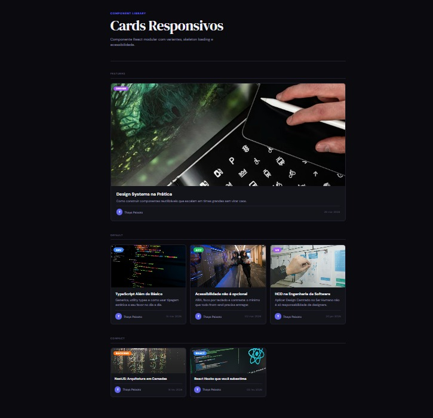

# Cards Responsivos

Componente React modular com variantes, skeleton loading e acessibilidade — construído com TypeScript, Vite e CSS puro.



---

## Sobre o projeto

Este projeto nasceu com um objetivo claro: construir um componente de card da forma que times profissionais constroem — com tipagem estática, separação de responsabilidades, estados de loading e acessibilidade desde o início, não como adendo.

O componente suporta três variantes visuais (`featured`, `default`, `compact`), skeleton loading animado para estados de carregamento, e navegação por teclado com foco visível.

---

## Tecnologias

- React 18
- TypeScript
- Vite
- CSS3 (sem bibliotecas externas)

---

## Funcionalidades

- **3 variantes** — `featured`, `default` e `compact`, controladas por prop
- **Skeleton loading** — componente `CardSkeleton` com animação shimmer que imita a estrutura do card real
- **Acessibilidade** — `aria-label`, navegação por teclado, foco visível e atributo `loading="lazy"` nas imagens
- **Design tokens** — cores, tipografia e espaçamento centralizados em variáveis CSS no `App.css`
- **Barrel export** — imports limpos via `index.ts`
- **Hook customizado** — lógica de dados isolada no `useCards`, separada do componente visual

---

## Estrutura do projeto

```
src/
├── components/
│   └── Card/
│       ├── Card.tsx           # Componente principal
│       ├── Card.css           # Estilos com variantes
│       ├── CardSkeleton.tsx   # Estado de carregamento
│       ├── CardSkeleton.css   # Animação shimmer
│       └── index.ts           # Barrel export
├── hooks/
│   └── useCards.ts            # Lógica de dados separada do visual
├── mocks/
│   └── cards.mock.ts          # Dados mockados (substitui chamada à API)
├── types/
│   └── card.types.ts          # Interfaces TypeScript
├── App.tsx
└── App.css                    # Design tokens globais
```

---

## Como rodar localmente

```bash
# Clone o repositório
git clone https://github.com/seu-usuario/cards-responsivos.git

# Entre na pasta
cd cards-responsivos

# Instale as dependências
npm install

# Rode o projeto
npm run dev
```

---

## Props do componente

| Prop | Tipo | Obrigatório | Descrição |
|---|---|---|---|
| `id` | `string \| number` | ✅ | Identificador único |
| `title` | `string` | ✅ | Título do card |
| `description` | `string` | ❌ | Descrição (oculta na variante `compact`) |
| `imageUrl` | `string` | ❌ | URL da imagem |
| `imageAlt` | `string` | ❌ | Texto alternativo da imagem |
| `badge` | `CardBadge` | ❌ | Badge com label e cor |
| `variant` | `'default' \| 'featured' \| 'compact'` | ❌ | Variante visual (padrão: `default`) |
| `author` | `{ name: string; avatarUrl?: string }` | ❌ | Dados do autor |
| `date` | `string` | ❌ | Data de publicação |
| `href` | `string` | ❌ | Transforma o card em link |
| `onClick` | `() => void` | ❌ | Torna o card clicável como botão |

---

## Exemplo de uso

```tsx
import { Card } from './components/Card';

<Card
  id={1}
  title="TypeScript Além do Básico"
  description="Generics, utility types e como usar tipagem estática a seu favor."
  imageUrl="https://exemplo.com/imagem.jpg"
  imageAlt="Código TypeScript num editor"
  badge={{ label: 'Dev', color: 'blue' }}
  variant="featured"
  author={{ name: 'Thays Peixoto' }}
  date="15 mar 2026"
/>
```

---

## Decisões técnicas

**Por que um hook customizado?**
O `useCards` mantém a lógica de busca de dados completamente separada do componente visual. Quando a aplicação evoluir para consumir uma API real, só esse arquivo precisa mudar — o `Card.tsx` não sabe e não precisa saber de onde os dados vêm.

**Por que CSS puro e não Tailwind?**
A escolha foi intencional: demonstrar domínio de CSS com variáveis, seletores de variante, pseudo-classes e animações sem depender de utilitários. O mesmo resultado visual pode ser obtido com Tailwind — a estrutura do componente não muda.

**Por que barrel export?**
Centralizar os exports no `index.ts` garante que quem importa o componente nunca precise conhecer a estrutura interna de arquivos. É uma convenção amplamente adotada em design systems e bibliotecas de componentes.

---

## Autora

**Thays Peixoto** — Desenvolvedora Front-end

[GitHub](https://github.com/ThaysPei) · [LinkedIn](https://www.linkedin.com/in/thays-peixoto-da-silva/)) · [Medium](https://medium.com/@thabysilva12)

